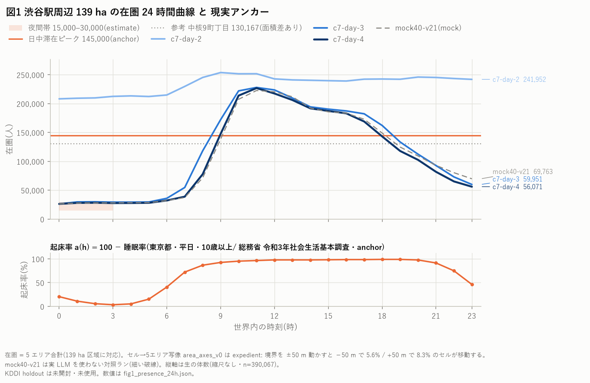
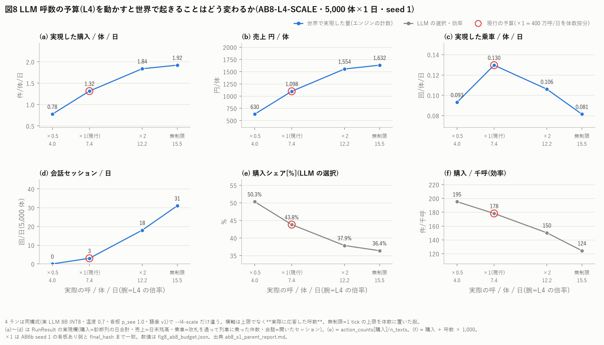
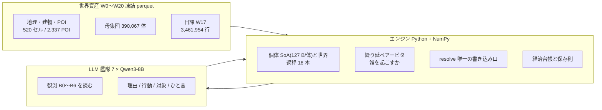
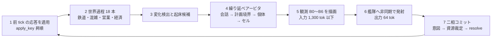

# shibuya-simulation-v2

[](https://github.com/spacedream6090-svg/shibuya-simulation-v2/actions/workflows/ci.yml)

**現実の渋谷を仮想空間に再現する、LLM 社会シミュレーションの第 2 世代。**

渋谷駅周辺(セル 520・POI 2,337・組織 9,872)に **390,067 体**の住人・従業者・来街者を置き、1 分刻みで 1 日(1,440 tick)を回す。意思決定と発話だけを LLM(Qwen3-8B・7 GPU の vLLM 艦隊)が担い、世界の法則(保存則・物理・台帳)はエンジンが持つ。1 シミュレーション日を実 LLM で **9 時間 10 分**で完走し、同じ seed からテープ再生でハッシュ一致まで再現できる。

第一目標は **「世界そのものがプロダクト」**。現実整合アンカーの台帳を育て、**どこが現実から歪んでいるかを宣言する**ことを開発の実務とする。研究観測(相互作用・組織形成・語彙創発)や事業利用は、その世界の上で走るアプリケーション。

> 設計の背骨は 1 行で言える: **状態と集約はエンジン、意思決定と発話だけ LLM**。
> 世界の変化はエージェントの行動の結果として起こす(棚が減るのは、店員が補充行動をしたから)。

- 5 分で全体像: [docs/design/v2-architecture-overview-simple.md](docs/design/v2-architecture-overview-simple.md)(開発者向け詳細は [detailed](docs/design/v2-architecture-overview-detailed.md))
- 正典: [決定台帳 v2-redesign.md](docs/design/v2-redesign.md)・[方法論 v2-methodology.md](docs/design/v2-methodology.md)・[運用規律 CLAUDE.md](CLAUDE.md)
- 現況: [STATUS.md](STATUS.md)(索引)・[IMPLEMENTED.md](IMPLEMENTED.md)(完了 40 項)・[PENDING.md](PENDING.md)(判断待ち)
- リサーチ答申 100 本超の索引: [docs/research/INDEX.md](docs/research/INDEX.md)(出典の一次確認の等級つき)

## 実証済みのこと

数値はすべてリポジトリ内の記録から取り、出所を併記した(推測値は書かない)。

| 何 | 値 | 出所 |
|---|---|---|
| 規模 | 390,067 体 × 1,440 tick(1 シミュ日)・世界過程 18 本・実 LLM 7×Qwen3-8B INT8(温度 0.7) | [build-report-C7 §1j](docs/ops/build-report-C7.md) |
| 壁時計 | **9 h 10 m**(7×A5000・艦隊 78 応答/s)・RSS 1.6 GB・LLM 呼 2,706,593(6.94 呼/体/日)・繰り延べ 0.55% | 同上 |
| 受入 | 受入表 16 行のうち判定できた 11 行が全て合格(壁時計 W1・メモリ M8・出力 S1・呼数 L4・保存則・被覆 WC-6) | [accept_c7-day-4](docs/bench/c7/accept_c7-day-4/c7_accept.md) |
| 決定論 | テープ再生で checkpoint 4 点 × 5 ハッシュ全一致(`8f8ee7e8`)。vLLM のバッチ不変性 ON で温度 0 の出力・logprobs とも **32/32 一致**(OFF では 3/32・0/32) | 同上・[B14](docs/bench/b14_batch_invariance/README.md) |
| 事前登録した holdout | KDDI 滞在人口(封印データ)への照合を**開封前に**腕・指標・合格線・予想まで登録し、3 seed で開封 → **0/4 不合格**。落ち方: ピーク時刻(sim 10〜13 時 vs 実データ 15〜18 時)と来街者比(最大差 0.395)。エリア構成の JSD だけは同値検定で合格 | [prereg_arms_v1](docs/bench/c7/prereg_arms_v1.md)・[c7_holdout_compare](docs/bench/c7/holdout/c7-day-4/c7_holdout_compare.md) |
| seed 差 | 同構成で seed だけ違う 2 ランの在圏差は 中央値 0.54%・最大 4.49%(05 時)。エリア別 24 h シェアの JSD 0.000162 bits = 合格線の **1/75** → holdout の外れは seed でなく**構造**に帰属できる | [c7-day-4_seed1_vs_seed2](docs/bench/c7/ensemble/c7-day-4_seed1_vs_seed2.md) |
| 経済 | 6 部門 15 科目の台帳。faucet/sink を全登録し、日次センサスの残差 0 | [build-report-C7](docs/ops/build-report-C7.md) |
| テスト | `def test_` 2,298 本・層契約 lint・秘密スキャン・CI | [tests/](tests/)・[.github/workflows/ci.yml](.github/workflows/ci.yml) |

### ablation で分かったこと(5,000 体 × 1 日・実 LLM・切替口は既定不変)

- **呼数の予算は結果を駆動する**。予算 ×0.5 / ×1 / ×2 / 無制限で、実現した購入/体/日は 0.78 / 1.32 / 1.84 / 1.92(現行は飽和点の 69%)。会話は無制限でも 0.006 セッション/体/日 — 会話の少なさは予算のせいではない。([AB8](docs/bench/c8/ablation/ab8_s1_parent_report.md))
- **看板(広告)を全部消しても購入は動かない**。無制限で |Δ| ≤ 0.11 pp・上限ありの +0.3〜0.5 pp は予算の影。休憩 +2 pp と会話 ×2.6 は残る=文面の中の注意配分の効果。([AB6b](docs/bench/c8/ablation/ab6b_s2_parent_report.md)・[AB6c](docs/bench/c8/ablation/ab6c_s1_parent_report.md))
- **語彙を外して自由記述にすると語彙は薄まる**。接地 98.4% のうち 93% が同義語辞書経由・行動エントロピー 1.56 → 1.14 bits。([AB7](docs/bench/c8/ablation/ab7_s1_parent_report.md))
- **語彙に「食事」を足す**と食事 44% は購入の付け替え(畳むと JSD 0.364 → 0.012)。2 seed で再現。([AB7c](docs/bench/c8/ablation/ab7c_s2_parent_report.md))

図はすべて [tools/fig/](tools/fig/) のスクリプトで作り直せ、PNG + SVG + 数値サイドカー JSON の 3 点が出る([docs/bench/figures/README.md](docs/bench/figures/README.md))。

| 図 1 在圏 24 時間(5 エリア合計・現実アンカーと同じ軸) | 図 8 呼数予算 ×0.5〜無制限と実現量 |
|---|---|
|  |  |

## 分かっている限界(歪む場所の宣言)

- **思考の量が人に届いていない**。LLM 呼 6.9/体/日 に対し人の思考は 4,000〜6,240/日(1/580〜900)。会話は 0.001 セッション/体/日(参加する体は 0.2%)。([思考頻度ノート](docs/research/v2-thought-frequency-anchors-note.md))
- **holdout に落ちた箇所**: ピーク時刻と来街者比(上表)。次の主張は未開封の別層で行う。
- 役割行動(補充・開閉店・発車)は LLM が選ばず、エンジンのフォールバックが担っている(被覆 100%・conf 0.5 として宣言)。
- 記憶・関係・群・規範は**未実装**(設計は決定済み・実装の順序待ち)。認知 3 層のうち実行時に動くのは速い層だけで、熟慮層は本番で 0 回。
- 行動語彙は 24 語+同義語辞書(辞書の意味損失は [語彙政策](docs/design/v2-synonym-policy-v0.md) で宣言)。
- ランは 1 日単位で、複数日と再開の口はまだ無い。

## 構造



- **世界資産**は 21 段階(W0〜W20)のビルドで一度だけ作り、ハッシュで凍結する。同じ入力から作り直すとバイト一致する。
- **エンジン**は破れない法則だけを持ち、世界状態への書き込み口は 1 本に閉じている。世界過程も例外にしない。
- **LLM** は世界を書き換えられない。返すのは 2 行の文字列だけで、エンジンが前提条件を検査して受理/拒否する。



呼の応答は次の tick 以降に適用する(非同期)。誰を起こすかはアービタが優先クラスで決め、起こされなかった体はエンジンが計画どおりに継続させる。全員が常に考え、遠い/重要でないものは粗く考える(憲法 1)。

## 設計原則(憲法 6 条・要約)

原文は [決定台帳 §3a](docs/design/v2-redesign.md)。

1. 計算制約は「打ち切り」でなく「解像度」で吸収する(ゼロ発火帯・n 人上限・記憶切り捨てを世界規則から追放)。
2. 経済は実フローで閉じる(域外から金が湧く経路を断つ。倒産・失業は世界の正当な出来事)。
3. 心と世界は相互に見える(身体感覚はプロンプトへ、表現形・宛先は LLM 出力から。実文のない「会話」が世界を動かすことを禁止)。
4. 解像度は較正とペアでしか足さない(検証データを対で用意できない細部は装飾)。
5. 知覚されない細部は作らない。
6. 粗くする場所は宣言して粗くする(古典が強い層は古典で較正し、古典が空洞な層に LLM の意味的解像度を置く)。

## 方法論(検証の規律)

[v2-methodology.md](docs/design/v2-methodology.md) の要点。全て強制。

- **パターン台帳ゲート**: 全機能は「どの現実パターン照合で使うか」を 1 行で書けなければ作らない。
- **mechanism / expedient**: 全ての cap・近似にタグを付け、expedient は感度試験で「結果を駆動していない」ことを示す(駆動していたら宣言して残す=上の AB8 が初例)。
- **保存則は紙上で閉じてから実装**し、月次・日次の経済センサスで測る。
- **予算宣言**(壁時計・RSS・バイト・呼数)を機能追加前に置き、テストでゲートする。
- **holdout は最初に封印**し、較正が触れない。照合は事前登録して 1 回だけ開ける。
- **決定論**: 同 seed で bit 一致。実 LLM もバッチ不変性でテープ再生と一致させる。
- **独立検収**: 工程ごとに受入報告([docs/ops/build-report-Cn.md](docs/ops/))を書き、別のレビュー役が再現する。
- **出典の一次確認**: リサーチ答申の数値・逐語は正典化前に原典で確認し、等級(A〜E)を索引に残す。

## 次にやること

- **判断層**: 速い判断(閉じた出力=選ぶ)と遅い思考(開いた出力=生成)の二層認知。LLM を呼ぶかどうかも葛藤・驚き(予測誤差)で決める門番に任せ、思考の量を人の錨に近づける。
- **記憶・習慣・関係**: 設計済みの ACT-R 型の基底活性を実装し、関係の強さを相互作用の記憶から導く。
- **複数日ランと再開**: `resume == straight`(途中再開と通しの完全一致)を最初の受入条件にする。
- **事前登録 v2**: 未開封の holdout 層で次の主張を立てる(来街者の作り直しと同時)。

## リポジトリの地図

| 場所 | 中身 |
|---|---|
| [src/shibuya/](src/shibuya/) | 10 層のパッケージ(`manifest, build, core, world, agents, perception, llm, engine, economy, census`)。依存規則は import-linter で固定 |
| [tests/](tests/) | 単体・性質(hypothesis)・golden・退化検査。既定 checkpoint のハッシュ不変をテストが守る |
| [tools/](tools/) | `c6` 実 LLM スモーク・`c7` 本番受入と holdout・`c8` ablation runner と感度・`fig` 図・`vocab` 語彙のオフライン裁定・`w17` 日課の物差し・`research` 答申索引 |
| [docs/design/](docs/design/) | 決定台帳・方法論・契約書(知覚/行動)・各ラウンドの設計アジェンダと判断待ちの詳説 |
| [docs/research/](docs/research/) | リサーチ答申と親の一次確認ノート([INDEX](docs/research/INDEX.md)・[分野地図](docs/research/v2-discipline-map.md)・[残務](docs/research/research-backlog.md)) |
| [docs/bench/](docs/bench/) | ベンチ・受入・holdout・アンサンブル・ablation の親報告と図 |
| [docs/ops/](docs/ops/) | 工程 C0〜C8 の受入報告・[サーバー運用の知見](docs/ops/v2-server-lessons.md)・独立検収のチェックリスト |
| [docs/log/](docs/log/) | 開発ログ(1 交換 1 エントリ・10 件ごとに圧縮) |

## 開発

Python 3.12 以上。GPU なしで動くもの(ビルド・mock ラン・テープ再生・図・テスト)と、GPU が要るもの(実 LLM ラン=自前の vLLM 艦隊)を分けている。

```powershell
python -m venv .venv
.venv\Scripts\python.exe -m pip install -e ".[dev]"
.venv\Scripts\lint-imports.exe          # 層契約(実装計画書 §3)
.venv\Scripts\python.exe -m pytest -q   # 単体・性質テスト(GPU 不要)
git config core.hooksPath .githooks      # コミット前の秘密スキャン(CLAUDE.md §7)
```

- 実 LLM ランは vLLM(検証は 0.28.0)を `VLLM_BATCH_INVARIANT=1` で起動する。再現性を主張するランは必ず ON(B14)。艦隊の起動と事故の型は [docs/ops/v2-server-lessons.md](docs/ops/v2-server-lessons.md)。
- 工程 C0〜C8 の手順と無人運転の規律は [実装計画書 §9](docs/design/v2-implementation-plan.md)。
- GPU 必須テストは `@pytest.mark.gpu`(CI は GPU なし段のみ)。

## データ

`data/`(世界資産・テープ・ラン出力・回収物で約 23 GB)は Git 外。内容物・出典・ライセンス・商用可否は [docs/data-license-ledger.md](docs/data-license-ledger.md) を正とする。holdout(KDDI 滞在人口・人流計測)は封印し、較正には使わない。

## 開発体制

計画・意思決定・検収・統合は親エージェント(Claude)が担い、実装とリサーチはサブエージェントに出す。サブの完了報告は信用せず、ディスク実在と親自身のテスト・原典確認で検収する。設計はユーザーとの Q&A で細部まで決めてから実装に入り、全決定は決定台帳に番号つきで残す([CLAUDE.md](CLAUDE.md))。

## v1 との関係

前世代リポ `shibuya-simulation` は参照専用ベースライン。git 履歴・エンジンコード・ラン出力は v1 に残置し、本リポには文書・データ・設計の「型」だけを持ち込んだ(ゼロベース宣言)。v1 で踏んだ失敗の型は [方法論](docs/design/v2-methodology.md) と [運用の知見 §11](docs/ops/v2-server-lessons.md) に写してある。

## ライセンス

未定(法務答申 [docs/research/v2-legal-licensing-deep-research.md](docs/research/v2-legal-licensing-deep-research.md) に基づき決定予定)。それまで All rights reserved。
