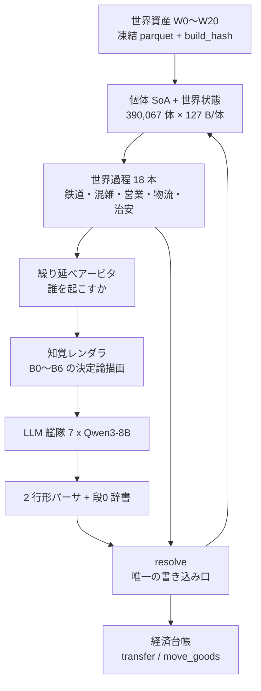
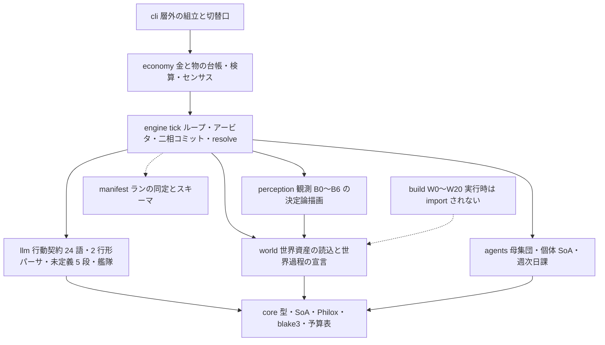
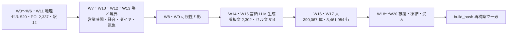
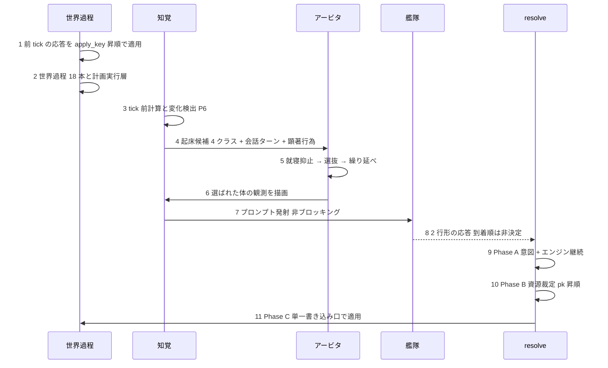
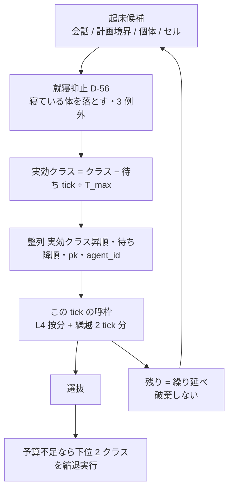
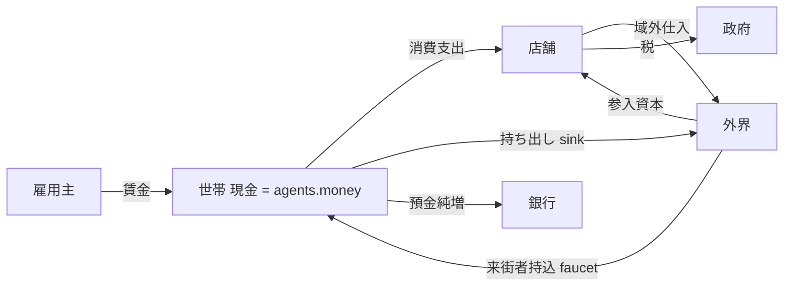
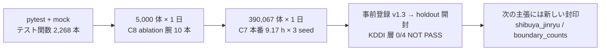

# v2 アーキテクチャ概要 — 詳細版(開発者向け)

> 位置づけ: **いま動いているコードと資産の地図**。設計判断の理由は正典([v2-redesign.md](v2-redesign.md) 決定台帳・
> [v2-methodology.md](v2-methodology.md) 方法論・各契約書)にあり、本書はそれを実装側から一望できるようにまとめ直したもの。
> 数値・語彙・名前はすべてリポジトリ内のファイルから取り、出所をリポジトリ相対パスで併記した。**確認できなかったものは「未確認」と書く**。
> 初見の人向けの 5 分版: [v2-architecture-overview-simple.md](v2-architecture-overview-simple.md)。最終更新 2026-09-19。

---

## 0. 目次

1. [背骨と三層](#1-背骨と三層) / 2. [モジュール地図](#2-モジュール地図) / 3. [世界資産の構築 W0〜W20](#3-世界資産の構築-w0w20)
4. [1 tick の流れ](#4-1-tick-の流れ) / 5. [繰り延べアービタ](#5-繰り延べアービタ) / 6. [契約](#6-契約-観測--行動--結果)
7. [日課 W17 と計画実行層](#7-日課-w17-と計画実行層) / 8. [経済](#8-経済-sfc-と保存則) / 9. [予算](#9-予算宣言)
10. [検証](#10-検証の段) / 11. [切替口](#11-切替口-cli) / 12. [既知の穴と判断待ち](#12-既知の穴と判断待ち) / 13. [未確認](#13-未確認のもの)

---

## 1. 背骨と三層

**状態と集約はエンジン、意思決定と発話だけ LLM**(`CLAUDE.md` §3)。
世界再現の方式は「手続きを書かず基盤を書く」三層([v2-redesign.md](v2-redesign.md) §4b):

| 層 | 中身 | 実装 |
|---|---|---|
| 層1 破れない法則 | 保存則(金・モノ・身体・空間・時間)・物理・台帳 | `src/shibuya/economy/`・`src/shibuya/engine/` |
| 層2 役割の知識 | 「あなたは店員だ」+ 汎用行動プリミティブ。手順は LLM の世界知識から。エンジンは実行可能性だけ検査 | `src/shibuya/perception/templates.py` B0・`src/shibuya/llm/contract.py` |
| 層3 未定義の裁定 | 語彙にない行動を却下せず、保存則内で帰結を決め、判例として結晶化 | `src/shibuya/llm/undefined.py`・`tools/vocab/adjudicate.py` |

憲法 6 原則(同 §3a)のうち、本書で繰り返し効いてくるのは次の 3 つ。

1. **計算制約は打ち切りでなく解像度で吸収する。** ゼロ発火帯・n 人上限・記憶切り捨てを世界規則から追放した。アービタが呼を落とすのは「破棄」ではなく「繰り延べ」である。
2. **知覚されない細部は作らない。** 全世界状態フィールドは届き先(チャネル × ブロック)を宣言する。宣言のない細部は削除候補として台帳に自動掲載される。
3. **粗くする場所は宣言して粗くする。** 全 cap/近似に `mechanism|expedient` タグ。expedient は感度試験で「結果を駆動していない」ことを示す義務がある。



**書き込み口が 1 本**であることが全体の要。`engine/resolve.py` の外から世界状態を書くことは、
AST 検査(`tests/economy/test_single_write_path.py`)と NumPy の `writeable=False` フラグで二重に止めてある。
世界過程も例外にしない(`src/shibuya/engine/processes/runner.py` 冒頭)。

---

## 2. モジュール地図

`src/shibuya/` は 11 パッケージ。層順は import-linter で機械強制される(`pyproject.toml` `[tool.importlinter]`)。

```
census > economy > engine > (perception | llm) > (world | agents) > core > manifest
```



契約は 5 本(`pyproject.toml`)。層順のほか、**core は manifest を import しない**・**llm は world/agents/perception/engine/economy/census を import しない**(mock LLM が成立する条件)・**build は実行時に import されない**・**economy は world/agents/perception/llm を import しない**(書き込みは engine の transfer 単一 API 経由)。

| パッケージ | 行数 | 主なファイルと責務 |
|---|---|---|
| `core` | 1,789 | `types.py`(`EventClass`・`DEFERRAL_CLASSES`・tick/t_sim_ns 二層時刻)・`soa.py`(バイト予算 M9)・`hashing.py`(blake3 タイブレーク・apply_key)・`rng.py`(Philox ドメイン分離)・`growth.py`(状態成長宣言 D-R2-6)・`budget.py`(予算表の機械読み取り) |
| `manifest` | 826 | ランの同定(13 節 pydantic)・`schema.DIAG_COLUMNS`・`world_catalog`(凍結カタログ 57 クラス・分母 SHA `34f9fa9d316587be`) |
| `agents` | 1,772 | `state.py`(`AgentKind` 9 種・`Activity` 8・`ResultCode` 21・`WakeCondition` 11・`REFRACTORY_MINUTES`)・`population.py`(W16 読込)・`weekly.py`(W17 読込)・`schedule.py`(mock 合成日課) |
| `world` | 5,215 | `assets.py`(凍結 parquet の読み口)・`state.py`(World・密度段階)・`processes/`(世界過程の**宣言**・台帳・憲法5 機械検査・`first_batch.build_registry`) |
| `perception` | 4,226 | `renderer.py`(B0〜B6 描画 1,773 行)・`templates.py`(文面凍結・`intent_mode`・`vocab_version`)・`p_notice.py`(2 段ヒル型)・`attention.py`・`channels.py`(チャネル別上限)・`normalize.py`(正規化規約 9 項)・`hashes.py` |
| `llm` | 4,500 | `contract.py`(行動語彙と契約表 881 行)・`parser.py`(2 行形・寛容行指向)・`undefined.py`(段0 辞書と 5 段)・`fleet.py`(vLLM 艦隊 1,879 行)・`mock.py` |
| `engine` | 16,280 | `run.py`(tick ループ・`RunResult` 2,652 行)・`resolve.py`(適用 2,231 行)・`arbiter.py`・`commit.py`(二相コミット)・`presence.py`(計画実行層 1,516 行)・`conversation.py`・`change_detect.py`(P6)・`llm_bridge.py`(録画/再生)・`tape.py`・`geometry.py`(C9 辺上位置)・`processes/`(世界過程の**実装** 18 本) |
| `economy` | 4,089 | `ledger.py`(`transfer` 単一 API)・`goods.py`(`move_goods`)・`accounts.py`(6 部門 / 15 科目 / faucet-sink 表)・`checks.py`(検算 ①②・T3)・`census.py`(日次 / 月次 MER)・`pricing.py`・`anchors.py`・`entry_capital.py` |
| `build` | 18,647 | `run.py`(W0〜W20 の通し)+ `geo` / `field` / `vis` / `lang` / `pop` / `sched` / `audit` |
| `cli.py` | 791 | 世界・台帳・センサスを束ねて `engine.run.run_day` を呼ぶ**層外の組立**。腕の切替口はここ |
| `census` | 4 | 現状ほぼ空(層の枠だけ) |

外側の道具: `tools/c6`(実 LLM スモーク)・`tools/c7`(本番受入・holdout・アンサンブル)・`tools/c8`(ablation runner・感度・計器盤)・`tools/fig`(論文用の図)・`tools/vocab`(オフライン裁定)・`tools/w17`・`tools/scan_secrets.py`。
テストは `tests/` 配下に 21 ディレクトリ・`def test_` 2,268 本(直近の実行記録 2,581 passed = `docs/log/devlog-compressed.md` 第219)。

---

## 3. 世界資産の構築 W0〜W20

`python -m shibuya.build.run --out data/world/v2` で 21 段階が走る。各段階は**純関数 + ヘッダ**
(`input_hash` / `param_hash` / 出力 sha256)で、全段階の sha256 を W 番号順に連結した sha256 が `build_hash`。
同じ入力から作り直すとバイト一致する(`src/shibuya/build/run.py`)。仕様は [v2-world-data-build-spec.md](v2-world-data-build-spec.md)。



**実行順とハッシュ順は別**(W8/W9 は W10/W11 の出力が要るので W13 の後に走る)。

| 段階 | 出力の実数(`data/world/v2/W*.header.json`) |
|---|---|
| W0 原点・座標系 | `world_crs.json` |
| W1 歩行グラフ | ノード 3,499・辺 4,944・辺ジオメトリ 15,132 |
| W2 セル生成 | **セル 520**・街区 1,227 |
| W3 全点対距離 | セル距離表 520²・道路ノード next-hop 3,499²(48.9 MB) |
| W4 建物・高さ | 7,210 |
| W5 入口点 | 7,261 |
| W6 POI・組織 | **POI 2,337・組織 9,872** |
| W7 営業時間 PlanSpec | 2,337 |
| W8 可視性 | ターゲット 9,592・T1 356,732 行・T1 セル束ね 43,479・T2 520×520 |
| W9 影グリッド | 288 時刻面 |
| W10 静的騒音場 | 街路点 356,732(昼/夜 × 生値/段階) |
| W11 駅・出口 | 駅 12・出口 45・駅内グラフ ノード 60 / 辺 57 |
| W12 外界ノード | 10 ノード・発生重み 2,014・時刻表 9,574 |
| W13 気象日再生 | 35 日・時別 840 |
| W14 看板文(実 LLM・凍結) | プロンプト 2,337 → **採用 2,302** |
| W15 セル静的文(実 LLM・凍結) | 520 → **採用 514** |
| W16 母集団合成 | **390,067 体**・世帯 27,404・乗務名簿 1,282・町丁目 80 |
| W17 週次日課(実 LLM) | **3,461,954 行**(= 8.88 ブロック/体/日) |
| W18 世界被覆指標 | 57 クラス。`vector` = C 0.4249 / Q 0.2041 / D 0.3268 / V 0.0 / R null、過剰 X 0.004056、孤児 0、死蔵候補 4(`data/world/v2/wc_index.json`) |
| W19 manifest 凍結 | 96 行 + holdout 封印 3 層(`kddi_la` / `shibuya_jinryu` / `boundary_counts`) |
| W20 受入パック | セル地図・出口・騒音・影・可視性の PNG + ゲート表 |

W14/W15/W17 は **LLM で作って凍結した資産**である(ランのたびに生成しない)。
W17 は 2026-09-12 に v2(本人がブロック形式で書く 1 日ぶん)へ入れ替わった(`IMPLEMENTED.md` #19)。

---

## 4. 1 tick の流れ

正典は運用設計書 §2.2/§2.4、実装は `src/shibuya/engine/run.py` の `run_day`(逐次ループ宣言 P4: tick 数 1,440 ぶんのループ 1 本 + 選抜された呼数ぶんのループ 1 本。それ以外は配列演算)。



各段の中身(⑤ アービタは [§5](#5-繰り延べアービタ)、⑧ パーサは [§6](#6-契約-観測--行動--結果) で扱う):

- **① 応答の適用** — 応答は到着順に適用しない。`apply_key`(`core.hashing.apply_key_array`)の昇順で適用するので、艦隊の返り順が非決定でもランは決定論になる。`t_apply` = 起床 tick + δ_perc + δ_think を分 tick へ切り上げ(既定 δ_think = 1 tick = 認知設計 §1 の L1 レーン 2.6 秒)。
- **② 世界過程** — `PROCESS_ORDER` の 18 本(`src/shibuya/engine/processes/runner.py`):
  `environment` / `rail` / `opening` / `crowd` / `traffic` / `delivery_inbound` / `shelf` / `waste` / `street_cleaning` / `last_mile` / `bus_taxi` / `road_works` / `hotel` / `infra` / `press` / `large_event` / `dispatch` / `salient`。
  最後の `salient` は台帳行を持たない結線器で、その tick に起きた事象をすべて拾ってから p_notice を判定する。
  同じ位置で**計画実行層**(`engine/presence.py`)が到着・退出イベントを回す。
- **③ 変化検出(P6)** — セル B2/B4 のハッシュ再計算 + 個体 B5 の閾値判定。実測 定常 1.07〜1.44 ms / 10% 変化 1.62〜2.32 ms / +個体 1% 跨ぎ 2.01〜2.68 ms @40 万体(`docs/design/v2-budget-declaration.md` P6)。**描画と検出は同じ 1 本の欄を読む**(二重計算しない)。
- **④ 起床候補** — 4 クラス(後述)+ 会話ターン(不応期 0)+ 顕著行為の到達 + 艦隊から繰り延べで返ってきた分の再投入(不応期免除)。
- **⑥ 観測の描画** — `perception.Renderer.render`。1 呼 1 描画。
- **⑦ 艦隊** — `llm/fleet.py` が背景スレッドの httpx イベントループで発射し、tick ループは止まらない。レプリカ配分 = `xxhash(call_id) mod 7`、不均衡時は least-in-flight。同一 GPU に寄せない(ベンチ BN-4 でセルアフィニティは不採用)。
- **⑨⑩⑪ 二相コミット** — `engine/commit.py`。Phase A は read-only で意図を集める(LLM 由来 + エンジン継続)。Phase B は資源ごとに優先度キー `pk = (ceil_ns(t_notice), blake3(run_salt‖tick‖resource_id‖agent_id))` の辞書式昇順で確定。**在庫減算は Phase C のみ**(保存則)。確率と優先度は混ぜない。

会話は `engine/conversation.py` が別に持つ。resolve が成立させた対を招待として受け、話者に会話ターン起床を毎 tick 出す。**終了は LLM に決めさせない**(ハード max_turns 1 体 3 呼・ソフトは話題スタック空/沈黙/退去/セル離脱)。

---

## 5. 繰り延べアービタ

`src/shibuya/engine/arbiter.py`。正典は知覚契約書 §6。

**恒常過負荷**(起床要求 ÷ 呼枠 ≈ 1.74)で回る前提なので、EDF(締切順)は主規則にしない
(過負荷 U>1 では domino effect で全部が締切を落とす。固定優先なら下位だけが落ちる)。



| 要素 | 値 | 出所 |
|---|---|---|
| クラス(昇順が優先) | `CONVERSATION=0` > `PLAN_BOUNDARY=1` > `INDIVIDUAL=2` > `CELL=3`。`INSTITUTION=-1` はエンジン側イベントで繰り延べ対象外 | `core/types.py` `EventClass` / `DEFERRAL_CLASSES` |
| 昇格までの待ち `T_MAX_TICKS` | 会話 3 / 計画境界 10 / 個体 30 / セル 60 tick(**expedient**。契約書は値を与えていない) | `engine/arbiter.py` |
| 昇格の式 | `eff_class = max(0, class − waited // T_max[class])`(累積 → starvation-free が算術で保証される) | 同上 |
| 呼枠の按分 | `call_budget_per_tick(n) = 4,000,000 / 1,440 × n / 400,000`。5,000 体で **34.72 呼/tick** | 同上(関数名は `per_tick_budget` ではない) |
| 繰越の上限 `POOL_CAP_TICKS` | 2.0 tick ぶん(**expedient**。夜間に溜めた枠で昼に暴発させないため) | 同上 |
| 縮退 | 対象は下位 2 クラス。コスト比 `DEGRADE_COST_FACTOR = 0.5`(**expedient**)。ただし**呼数の硬い上限 L4 には効かない**(2026-09-08 のバグ修正。縮退が減らすのは 1 呼あたりのトークンであって呼の本数ではない) | 同上 |
| 不応期 | 体 × 条件ごと。`REFRACTORY_MINUTES` = 会話 0 / 睡眠中 360 / 就業中 150 / 一般 60 / 移動中 15 / 内受容 45 / 知人 10 / 近接入替 15 / 被注視 5 / 傍受 5 / セル変化 30 分 | `agents/state.py` |
| 就寝抑止 | `activity == SLEEPING` の候補をアービタ前に落とす。例外 3 = 計画境界・顕著行為由来・会話ターン | `engine/arbiter.py`(D-56) |
| 診断行 | `DIAG_COLUMNS = ("deferred","promoted","degraded","suppressed")` + `sleep_suppressed` を**起床クラス別 / シミュ日**で必ず記録。記録のないランは較正・holdout 照合に使えない | `manifest/schema.py`・予算宣言表 §7-5 |

**純関数性**: `arbitrate()` は入力の並び順に依存しない。候補配列を任意に並べ替えても選抜集合・選抜順序・診断計数は同一(`tests/engine/test_arbiter.py` の性質テスト)。整列鍵 = `(eff_class 昇順, 待ち tick 降順, pk 昇順, agent_id 昇順)`。

**実測(c7-day-4・390,067 体・1 シミュ日)**: 応答 2,691,795 呼 = 6.90 呼/体/日。起床理由の内訳は
会話 300,089 / 計画境界 1,192,402 / 個体 558,249 / セル 641,055(`docs/research/v2-thought-frequency-anchors-note.md` §2)。
**5,000 体の検証ラン**では 応答 36,906 に対し 後回し 40,236・抑止 50,055(同 §2 S3)= 要求の約 3 分の 1 しか通っていない。

---

## 6. 契約(観測 → 行動 → 結果)

### 6.1 観測ブロック B0〜B6(世界 → 心)

正典 [v2-perception-contract.md](v2-perception-contract.md)。**不変条件 7 条**のうち実装に一番効くのは
「知覚 = 世界状態の決定論的射影(LLM は知覚を生成しない)」「観測は有界な完全現在形(差分観測は禁止)」
「文面凍結(テンプレは決定論・ハッシュで版管理)」。

ブロックは**変化率の昇順**に並ぶ。これは prefix 前方一致の効率と LLM の末尾重視バイアスが同じ並びを指すため。

| # | ブロック | 内容 | 予算 tok |
|---|---|---|---|
| B0 | system / 役割 | 憲法・役割知識の呼び出し・出力規約 | 300 |
| B1 | 種別 | 住民 / 通勤 / 通学 / 従業 / 来街 / 訪日 / 定期 / 乗務 / 指令 の 9 種 | 100 |
| B2 | 場所セル静的 | 可視物リスト・看板(a)・ランドマーク・W15 凍結文 | 150 |
| B3 | 時間帯・天候 | 制度時計・天候・日照・大事件 | 100 |
| B4 | 場所セル動的 | 密度段階(Fruin LOS)・騒音段階・顕著行為の到達分 | 60 |
| B4b | サブセル動的 | 行列・人だかり・グループ上位 k(25 m 級) | 40 |
| B5 | 個体固有 | 内受容(閾値割れ分)・知人 / 近接上位 k・被注視・傍受・所持・関係 | 220 |
| B6 | 起床理由・直前の結果・問い | 起床理由 20 + 直前の結果 50 + 問い 10 | 80 |

**実効ゲートはグループ予算**(共有静的 B0+B1+B3 ≤750 / セル依存 B2+B4+B4b ≤250 / 個体 B5+B6 ≤300 = 入力 ≤1,300)。
出力は **o64 既定**(BN-5 実測: 400 万呼が o128 で 20.4 h・o64 で 14.8 h = W1 内)。
実測の入力トークンは 920.8 tok(AB6b・看板あり腕)、個体枠の実測平均は 133.3 tok(`docs/design/v2-memory-agenda.md` §0)。

**バイト一致の正規化規約 9 項**(`perception/normalize.py`)。検査は「同じ**セル × 5 分帯 × 種別**の 2 体で B0〜B4 のバイト差分がゼロ」
(B1 が種別で分岐するので、契約書の「同セル同時間帯の 2 体」を実装側で解決した点は `perception/renderer.py` 冒頭に明記してある)。

### 6.2 行動語彙(心 → 世界)

正典 [v2-action-contract.md](v2-action-contract.md)。出力は **2 行形**:

```
理由: <40 字以内・1 文>
行動: <語彙 1 語> 対象: <セルID|物カテゴリ|人ID|なし> ひと言: <20 字以内|なし>
```

語彙は**全種別共通**で、権限はエンジンが検査する(「権限なき者の試行」を逸脱の創発として観測するため)。
`ALL_ACTION_WORDS` = 種別横断 12 + 役割 12 = **24 語**(上限 `VOCAB_LIMIT_PER_KIND = 24`)。

- 種別横断 12: 移動 / 乗車 / 降車 / 購入 / 待機 / 会話 / 退去 / 通報 / 手伝い / 断る / 休憩 / 就寝
- 役割 12: 接客 / 補充 / 開閉店 / 価格改定 / 発車 / 停車 / 放送 / 遅延報告 / 計画改訂 / 指示 / 並ぶ / 撮影

**語彙 v2** は横断語「食事」を足した 13 + 12 = 25 語で、**上限を 1 語超える**(どの語を封印するかは未決 = D-71 §3 J)。
v2 は動詞を足すのではなく**飲食店オブジェクトの affordance を足す**という形を取り、
`ACTION_VOCAB_12` などの v1 側のオブジェクトは 1 バイトも動かさない(`src/shibuya/llm/contract.py`)。

**必ず成功する行動が 1 つ以上ある**(待機)。これが段1 の落とし先でもある。

### 6.3 パーサと未定義行動

`src/shibuya/llm/parser.py` — ラベル基準の**寛容行指向**。例外を投げない。

- `format_ok`(C6 別名込みの寛容判定)と `strict_format_ok`(C6 以前の別名表だけ)を**別々に返す**。指標の定義を途中で変えないため。
- ラベルの言い換え(目的地 / 目的 / 行き先 → 対象)を別名表で吸収、ラベルを省いて値だけ並べた形は**位置**で読む。
- 対象欄に説明語の写し(「物のカテゴリ」等)が入る事故は正規化で吸収(`TARGET_PLACEHOLDERS`・`IMPLEMENTED.md` #33。根拠 = 対象≠なし 21,744 呼のうち 46% が説明語の写しだった)。

`src/shibuya/llm/undefined.py` — 未定義行動の受理 5 段:

| 段 | 中身 |
|---|---|
| 段0 | 辞書写像(**ゼロ呼**)。`SYNONYMS` 100 行。これは expedient でなく**語彙政策**として扱い、行ごとの意味損失(なし 61 / 軽微 8 / 対象の損失 17 / 意味の損失 14)を [v2-synonym-policy-v0.md](v2-synonym-policy-v0.md) に宣言する |
| 段1 | 未定義行動レコード + 失敗フィードバック + 計数 → 待機へ落とす |
| 段2 | 同一行動が閾値 N = 10 体で裁定 LLM が契約行を起草。**ラン内ではやらない**(2026-09-17 のユーザー決定でオフラインバッチ `tools/vocab/adjudicate.py` へ移した) |
| 段3 | 保存則・性能予算に触れる行は自動テスト + 親検収まで不採用 |
| 段4 | 採用後は語彙に加わり、2 回目以降は**契約表の決定論参照**(LLM を呼ばない) |

### 6.4 結果コード

`agents/state.py` `ResultCode` = 0 (`OK`) 〜 20 の **21 値**。
`UNREACHABLE` / `INTERRUPTED` / `TRAIN_FULL` / `FARE_SHORT` / `NO_TRAIN` / `NO_STOP` / `MONEY_SHORT` /
`OUT_OF_STOCK` / `CLOSED` / `PARTNER_BUSY` / `REFUSED` / `PARTNER_GONE` / `NO_BED` / `NO_PERMISSION` /
`LOST_ARBITRATION` / `UNDEFINED_ACTION` / `BAD_TARGET` / `INSUFFICIENT_ABILITY` / `NOT_IN_EATERY` / `TARGET_GONE`。

`RESULT_TEXT` が B6 の「直前の結果」50 tok 欄に短句で出る。文面は
「直前の<行動>は失敗。理由 = …。いま可能: <3 語>」で、**代替行動の提示が効果の大半**という先行の知見に従う。
同一失敗の繰り返しは 4 回で打ち切って待機へ落とす。

---

## 7. 日課 W17 と計画実行層

**日課が世界の骨格**である。各体は W17 の予定表どおりに動き、LLM は起床したときだけ介入する。

- W17 = 390,067 体 × 3,461,954 行 = **8.88 ブロック/体/日**。
- 5,000 体の検証ランでは、世界で実行された行動 270,424 件のうち **エンジン継続 236,860 件(87.6%)**・LLM が決めたのは 33,564 件(12.4%)(`PENDING.md` D-98・出所 `ablation_AB7c-VOCAB-V2_s1.json` の `action_usage`)。

**計画実行層**(`src/shibuya/engine/presence.py` 1,516 行・設計書 [v2-plan-executor-design.md](v2-plan-executor-design.md))は
2026-09-11 に新設された層で、D-66「域外居住 346,445 体(88.8%)が W16 で実装されず域内に常駐し職場で寝る」を
継ぎ足しでなく層として作り直したもの。

- 個体 SoA への追加は **2 B/体**(`plan_activity` int8 + `plan_flags` int8)。新しい `transit_state` の値は作らない。
- 日次に 1 回、`(tick, agent, type)` 昇順の決定論イベント列(ARRIVE / DEPART / SLEEP / WAKE)を組み、resolve の既存の口だけで実行する。
- 効果(mock 5,000 体): 5 エリア昼夜比 1.194 → 7.27、03 時の在圏 221,090 → 22,702、職場就寝 0、域外宛ての呼 0。
- 読み口は 3 版(`--derive-rule v1|v2|v2.1`)。既定 v2、主張腕 c7-day-4 は v2.1。

---

## 8. 経済(SFC と保存則)

方法論の規律として、**保存則系は実装前に紙上で収支を閉じる**。ただし「閉じる」は閉鎖系の要求ではない——
取引レベルの保存はエンジン強制、境界/制度の faucet・sink は全登録、残差科目と退蔵在庫項を含めて
収支が説明できる状態を指す(`CLAUDE.md` §4)。



> 図の矢印は**科目の例**であり、許される支払部門と受取部門の対は `economy/accounts.py` の `is_allowed` が正典。

- **6 部門**(`economy/accounts.py` `Sector`): 世帯 / 店舗 / 雇用主 / 銀行 / 政府 / 外界。第1陣では銀行は預金のみ・政府は税 sink のみ。
- **15 科目**(`AccountCode`): 消費支出・賃金・域外仕入・税・利子・家賃・預金純増・来街者持込(faucet)・持ち出し(sink)・参入資本・配当/内部留保・減価償却・残差・退蔵(**測度**であり transfer には使えない)・逸脱比例コスト。**列挙にない科目の transfer は実行不能**。
- **単一 API**: 金は `Ledger.transfer(payer, payee, amount, account_code)`、物は `GoodsLedger.move_goods`。残高の直接代入は静的に禁止(台帳配列は既定 `writeable=False` + AST 検査)。
- **世帯の現金は `agents.money` そのもの**(二重帳簿を作らない)。したがって resolve の writable ブロック外から transfer を呼ぶと `ValueError` になる。
- **検算 2 本**: ① 四重記入 = 取引フロー行列の行和・列和が 0 / ② 全主体の純資産合計 = 実物資産の価額(毎期・O(N) 総和)。
  **T3**(冗長方程式の毎期検算)は月次センサスの時点で ① を実データに対して走らせ、`t3_ok` を run manifest に載せる(`IMPLEMENTED.md` #35)。
- **ex nihilo 禁止**: 参入資本の支払部門は `ENTRY_CAPITAL_PAYERS` に限る。
- **センサス**: 日次(軽量 = 残差・貨幣供給量 + ゲートに要る最小限)/ 月次 MER(EVE Online 型の固定表 = 科目別 faucet・sink・貨幣供給量・残差・退蔵残高 + 部門軸)。**残差 > 閾値・純資産 ≠ 実物資産はゲート失敗**で、そのランは較正・holdout 照合に使えない。
- **O(t) ログの有界化**(D-R2-6): 生の取引ログは 24 B/行 × 3.0 行/体/日、物流ログは 16 B/行 × 2.0 行/体/日で、容量は **N 比例**(下限 16,384 行)。390,067 体で 28.1 + 12.5 MB = M8 の 0.17%。

---

## 9. 予算宣言

正典 [v2-budget-declaration.md](v2-budget-declaration.md)。**機能追加の門前条件は二重**——パターン照合 1 行(台帳)+ 予算行。どちらか欠けたらマージ不可。

| 行 | 宣言 | 実測 |
|---|---|---|
| **W1** 壁時計/シミュ日 | ≤24 h(40 万体・標準忠実度)。8 h は努力目標 | **9.167 h**(c7-day-4) |
| **W2** mock ラン | ≤10 分(5,000 体・CPU・mock) | 5,000 体 × 1 日 mock 3.17 s(C2 受入) |
| **W3** 律速の位置 | LLM が律速・物理は step 内訳 ≤10% | — |
| **P2** 物理フレーム | ≤300 ms/tick @40 万体(C9 辺幾何) | 移動 + 密度 125 ms/tick(c7-day-3 参考) |
| **P6** 変化検出 | 定常 ≤2 / 変化時 ≤3 ms/tick @40 万体 | 1.07〜1.44 / 1.62〜2.68 ms |
| **M1** 個体状態 | ≤30 KB/体 | 既定 **127 B/体** |
| **M8** RSS | ≤24 GB | **1.530 GiB** |
| **M11** 観測トークン | 入力 ≤1,300・出力 o64 既定 | 入力 920.8 tok |
| **L4** 起床数 | **上限 400 万呼/日**(憲法1 の監査点)/ 平均 **10 呼/体/日**がアービタの制御目標 | **6.90 呼/体/日**(39 万体)・7.38〜7.44(5,000 体) |
| **L5** 日次内省 T2 | 42 万呼/日 = L4 の 10.5% | **0 回/日**(本番で発火していない) |
| **L6** 起床キュー | 64 in-flight/GPU(ベンチ第3段の膝 c64) | — |
| **L2** ablation 取り分 | 総 GPU 時間の **20% を予約**(流用禁止) | — |
| **S1** 恒久記録 | ≤5 GB/シミュ日 | **0.175 GiB** |

運用規則で特に効いているもの: **予算は打ち切り(cap)ではない**(憲法1 により計算制約は解像度で吸収する)。
予算超過が観測されたら (a) 解像度宣言で粗くする か (b) 予算を宣言改訂する のどちらかで、**cap の静かな挿入は禁止**。
改版は delta 方式(旧値を残して日付つきで新値を追加。黙って数値を変えない)。

**状態成長宣言**(D-R2-6): 全モジュールは YAML 5 欄
(`per_agent_bytes` / `per_cell_bytes` / `per_day_growth` / `retention` / `worst_case_ops_per_tick`)で状態の成長を宣言し、
24 step スモークの実測を 1 日・30 日へ外挿して M 行を超えたら CI 失敗(`src/shibuya/core/growth.py`・`engine/growth_decl.py`)。

---

## 10. 検証の段



### 10.1 C6 — 実 LLM スモーク

`tools/c6`(7 本)+ `tests/c6`(93 本)。艦隊接続・失敗の意味論(接続エラー = 同一レプリカ 1 回 → 別レプリカ 1 回 /
タイムアウト = **繰り延べ**(破棄禁止・憲法1)/ 書式エラー = 温度 0 で 1 回再生成 → 未定義行動 5 段 /
キュー満杯 = 非ブロッキングで「入らなかった」を返しアービタが繰り延べ)。全て診断行に計数する。

### 10.2 C7 — 本番規模の受入

`tools/c7/c7_accept.py` が 16 行の受入表を出す(c7-day-4 は **判定済み 11/16・合格 11・不合格 0**)。
主な行: W1 / M8 / S1 / L4 / T2-a(5,000 体 同 seed 再ラン一致)/ T2-c(40 万体 checkpoint 自己整合 = テープ再生で
4 点 × 5 ハッシュ全一致・final `8f8ee7e8`・tape_miss 0)/ 診断 4 列 / 保存則 CONS-1,2 / 憲法5 / WC-6 孤児 0。
HOLD / SEAL の 2 行は holdout を開けるまで空欄。

**決定論の保証範囲**: ビット同一は捨て、「同一 seed = 同一軌道」を v2 内でのみ保証する(DT スナップショット定義と整合)。
テープ(`engine/tape.py` `shibuya.tape/2`)に呼と応答を録画し、`mode="replay"` で完全一致の再生ができる。

### 10.3 C8 — ablation

`tools/c8/ablation_runner.py` + `tools/c8/ablations_v1.json`(腕 10 本):

| 腕 | 問い |
|---|---|
| AB1-BUDGET-MODE | チャネル固定枠 vs 同一総トークンの単一ランキング(**義務 ablation**) |
| AB2-PNOTICE-D50 | p_notice の d50 を 0.5× / 2× |
| AB3-REFRACTORY-PROX | 近接入替の不応期 15 分 ±50% |
| AB4-HEARING-SNR | 聴覚 ΔSNR −3 / −5 dB |
| AB5-INTROSPECTION | 日次内省 1.05 回/日 vs 2〜3 回/日 |
| AB6-AD-ZERO / AB6b-AD-NOTICE | 広告ゼロ / 看板の注視ゲート p_see |
| AB7-OPEN-INTENT / AB7b-HINT / AB7c-VOCAB-V2 | 24 語のホワイトリスト vs 自由文 vs 語彙 v2 |

実測の一例(`docs/bench/c8/ablation/ab7c_s1_parent_report.md`・5,000 体 × 3 腕 115 分):
語彙 v1 の購入 43.8% は語彙 v2 で 食事 43.9% へ**付け替わる**だけ(食事を購入に畳むと JSD 0.3611 → 0.0132 bits)。
実際に食べられた食事は 7,024 件 = 選択 16,327 の 43% = **1.40 回/体/日**。
付随して 乗車 −47%・休憩 ×2.2 が起きたが、診断の結果これは予算・起床の変化ではなく**同じ呼の中の選択率の変化**
(乗車 3.9% → 1.7%)と、食事 → 休憩の連鎖(食事の次手の 22.0% が休憩 vs 購入の次手 7.2%)だった(`PENDING.md` D-91)。

もう一例(`docs/bench/c8/ablation/ab6b_s2_parent_report.md`・seed 2 で再現):
看板を消すと購入は **+0.28〜+0.51 pp 増える**(2 seed とも正・AD1 の線 1 pp の内側)。
2026-09-10 の測定(−1.34 / −1.02 pp)とは**符号が逆**。
含意 = 「LLM が広告に過剰反応する」は現行コードでは成り立たず、**ablation は世界の版つきで台帳に残し、版が変わったら測り直す**。
付随して看板行を消すと会話が 3.2 倍になる(注意の奪い合い)。

### 10.4 holdout の事前登録

`docs/bench/c7/prereg_arms_v1.md`。開封前に腕・指標・合格線・**予想**を固定し、開封後は追記しかしない。

- 主張腕 = c7-day-4 構成 × seed {1,2,3} のアンサンブル。seed 数 3 の根拠は実測 CV(N = (CV/r)²)。
- 帰無参照(seed 間の JSD)= **0.000178 bits** = H1 の線 0.0122 の **1/69**。
- v1.3 で統計を固め直した: 5 指標を家族として 95%(Bonferroni)・同値検定(pass / fail / **undecided** の 3 値)・
  深夜 0〜5 時は記述に格下げ・「3 本の幅に実測が入る」は**検定ではない**と明記(GET の p ≥ 1/s = 0.25)・fair CRPS を併記。
- **結果(2026-09-17 開封・1 回きり)= 0/4 NOT PASS**(undecided 0)。

| 指標 | c7-day-4 3 seed | 線 | 判定 |
|---|---|---|---|
| H1 相関 JSD / r(判定窓 6〜23 時) | 0.0221 ± 0.0037 / 0.699 ± 0.015(24 h では 0.0230 ± 0.0043 / 0.818 ± 0.012 = 記述) | ≤0.0122 / ≥0.80 | fail |
| H2 ピーク時刻 ±1h / τ | 0/5(3 seed とも)/ −0.74 ± 1.18 | 5/5 / ≥0.6 | fail |
| H4 エリア構成 JSD / 最大 Δ | 0.0089 ± 0.0011 / 0.0571 ± 0.0070 | ≤0.0122 / ≤0.05 | JSD は同値 pass・Δ fail → fail |
| H5 属性構成 JSD / 最大 Δ | 0.0807 ± 0.0035 / 0.395 | ≤0.02 / ≤0.10 | fail |

- 予想の答え合わせ: c7-day-2 が H1・H2 を落とす = **当たり**。c7-day-3 → 4 で H1 JSD が下がる = **外れ**(0.0185 → 0.0231 で悪化)。H5 が落ちる = **当たり**。「外れるなら seed でなく構造」= **当たり**。
- **停止則**: 主張はここで固定。以後の seed 追加・較正ランは本 holdout への主張に使えない。次の主張には新しい封印データが要る。

### 10.5 自己修正ループ(3 つの輪)

`v2-methodology.md` の「自己修正ループ」:

- **内側**(tick・個体の判断)= 修正を入れない(決定論と再生を守る)
- **中間**(ラン後のバッチ: 語彙・辞書・アンカー距離・感度の印)= 機械が起草し人が通す
- **外側**(世界の存在論・目的・ゲート線)= 人間

機械が起草する修正は、**現実側の封印データ/アンカー台帳との距離**か**エージェントの試みの台帳**(未定義行動・失敗コード)
からしか発火しない。**シミュレーション自身の出力の自己採点では発火しない**。
禁止 4 つ = LLM に世界を採点させて直す / 封印データを較正に使う / 目的関数を機械に持たせて自動フィットする / 修正の出所を記録しない。

---

## 11. 切替口(CLI)

腕はすべて**既定を 1 バイトも動かさない**形で足す(既定の checkpoint ハッシュが不変であることを退化検査で確認する)。
`python -m shibuya.cli` の主な切替口:

| 引数 | 既定 | 何の腕か |
|---|---|---|
| `--agents` / `--seed` / `--world` / `--ticks` | 5,000 / 1 / `data/world/v2` / 1,440 | 規模 |
| `--llm {mock,fleet}` `--endpoints` `--mode` `--temperature` `--max-tokens` `--fleet-wait-s` `--fleet-queue-capacity` | mock / — / smoke / 0.7 / 96 / 0 / 0 | 艦隊接続 |
| `--tape` `--replay` `--checkpoints-out` `--undefined-out` `--census-out` `--occupancy-every/-out` | 空 | 記録と再生 |
| `--budget-mode {fixed,ranking}` | fixed | AB1 知覚のトークン配分(義務 ablation) |
| `--pnotice-d50-scale` `--refractory-scale COND=F` | 1.0 / なし | AB2 / AB3 |
| `--no-signage` `--signage-p-see` | False / 1.0 | AB6 / AB6b |
| `--intent-mode {vocab,open,hint}` | vocab | AB7 自由意図 |
| `--vocab-version {v1,v2}` | v1 | AB7c 語彙 v2「食事」 |
| `--geometry {node,edge}` `--area-source {legacy,plateau}` `--seat-area-*` | node / legacy / None | C9 位置幾何・歩行可能面積・席面積 |
| `--derive-rule {v1,v2,v2.1}` `--exit-mode` `--attendance-rate` `--no-plan-executor` `--no-outside-suppression` | v2 / immediate / 1.0 / off / off | 計画実行層 |
| `--no-sleep-suppression` `--no-plan-sleep` | off / off | D-56 / D-62 の帰無腕 |
| `--ablate <過程 id / AB-*>` | なし | 世界過程を過程単位で切る |

**L4 の上限を振る切替口は無い**(アービタの `calls_per_day` 引数のみ)。これは D-99 で追加を検討中。

---

## 12. 既知の穴と判断待ち

### 12.1 穴(数字つき)

| 穴 | 数字 | 出所 |
|---|---|---|
| 思考頻度が人の 1/580〜900 | 人 4,000〜6,240 回/日 vs LLM 呼 6.90 回/日。内言(26%)に限っても 1/150〜235 | `docs/research/v2-thought-frequency-anchors-note.md` §3 |
| 会話が事実上ゼロ | 0.0021 セッション/体/日 = 410 件/日。体の 99.8% は 1 日会話しない。現実は覚醒の 27.9% | 同 §2・§3 |
| 日次内省が 0 | 本番で 1 回も発火していない(D-62 で就寝の計画境界は LLM を呼ばない)。L2 = 2,048 tok で出すと壁時計 78.4 h/日 = W1 を単独で壊す | `docs/design/v2-memory-agenda.md` §0 |
| holdout のピーク時刻が 3〜8 h 早い | sim 10〜13 時 vs KDDI 15〜18 時(5 エリア全部・3 seed 同一) | `docs/bench/c7/prereg_arms_v1.md` §8 |
| 来街者が半分以下・従業者が約 2 倍 | 来街者比 sim 0.14〜0.39 vs 0.40〜0.76、従業者比 sim 0.53〜0.76 vs 0.19〜0.47 | 同上 |
| 深夜の残りすぎ | central 深夜残存 sim 0.385 vs 0.140 | 同上 |
| 記憶・関係が未実装 | 会話の発話本文はいま捨てている(テープの `response` 列にしか残らない)。関係辺は C10 のアジェンダ段階 | `docs/design/v2-memory-agenda.md`・[v2-c10-relations-agenda.md](v2-c10-relations-agenda.md) |
| 世界被覆の深さが浅い | D(深度)0.327・V(検証済み率)**0.0**・R(到達率)null = 未実測 | `data/world/v2/wc_index.json` |
| 起床要求の 3 分の 2 が通らない | 5,000 体で 応答 36,906 に対し 後回し 40,236・抑止 50,055 | 思考頻度ノート §2 S3 |
| 上限が結果を形作っていたかを一度も測っていない | L4 = 10 呼/体/日 は宣言済み予算だが、expedient に課している感度試験を予算行に課していなかった | `PENDING.md` D-99 |

### 12.2 判断待ち(D-98〜D-101)

| # | 決めること | 選択肢 | 親推奨 | 状態 |
|---|---|---|---|---|
| **D-98** | 検証指標の組み直し。いまの「購入%」は分子が**選択**であって実現ではない(食事は選択の 43% しか成立しない)。呼数だけで割る比は忠実度に使えない(エンジン継続の販売が混ざり、会話が損に見える) | (a) 5 指標に分ける = ① 実現量/体/日 ② 実現量/応答した呼 ③ 実現/選択 ④ 呼/体/日・トークン ⑤ 同じ状況集合に対する選択分布の差。runner に実現欄を足す / (b) 販売数 ÷ 呼数の単一比 / (c) 現状のまま | **(a)**。ただし合否の線は D-99 の結果を見てから | 未決(第238) |
| **D-99** | 予算 L4 の感度腕 AB8。同構成で 0.5× / 1× / 2× / 無制限(全起床要求に応じる)を回す。5,000 体なら無制限でも約 3 倍の呼 | (a) 切替口を足して 4 腕(約 4〜5 h)/ (b) 回さない | **(a)**。過去の ablation と holdout が上限に形作られていたかが分かる | 未決(第238) |
| **D-100** | 状況固定のオフライン評価。テープにある同じ観測に腕ごとの文面で答え直させ、アービタも世界も挟まずに選択分布だけ比べる。プロンプト系 ablation(語彙・看板・意図)はこちらで測るのが筋(1 腕 10 分・帰属問題なし) | (a) `tools/c8` に replay 評価器を作る / (b) 作らない | **(a)**。AB8 の後 | 未決(第238) |
| **D-101** | 思考の階層と目標頻度を人の錨に結ぶ。LLM 呼で人の思考量に届かせるのは本番 390 倍で不可能 → ① 活動の切り替わり(W17・8.9/日 vs 人 13.9/日 = 桁が合う)② 型付きの速い判断 ③ 言葉の熟考(LLM・7 呼/日をここに集中)④ 会話(最大の穴)の 4 階層に分け、各階層の目標頻度を H1/H3/H5/H7 の錨で宣言する。**L4 を「思考の総量」と混同しない** | (a) 4 階層と目標頻度を認知設計に宣言し ②④ の器の設計ラウンドへ / (b) 現状の 1 階層のまま L4 だけ動かす / (c) 保留 | **(a)**。順序 = D-99 の AB8 → 型付き判断の腕 → 会話の器。判断器は**自前のインターフェース**(型付き質問 → 確率)にして背後を差し替え可能にする(第242 で更新) | 未決(第240・第241 ユーザー構想 → 第242 R-39/R-40 帰還) |

D-101 の背景にある第241 のユーザー構想 = 「思考と判断を分ける。System 1/2 に則って速い思考/遅い思考で層を分け、
LLM を呼ぶことさえ判断層に任せる」。R-39 の答申で分かったことは、**判断の割合を直接測った研究は無い**こと・
引き金は強度でなく**葛藤**であること・Type 2 は既定では発火せず監視は常時であること・確信は指標にならないこと。

---

## 13. 未確認のもの

本書を書く時点でファイルから確認できなかった項目(埋めていない):

- **`RunResult` の実現量の欄**(実現した購入・乗車・売上)。`n_boarded` / `n_board_timeout` は `RunResult` にあるが runner の出力欄に無い(`PENDING.md` D-91 の「未測」)。D-98 (a) で足す対象。
- **W17 ヘッダの `description` 欄**は空(各段階のヘッダに説明文が入っていない)。段階の意味は [v2-world-data-build-spec.md](v2-world-data-build-spec.md) の表から取った。
- **`census` パッケージ**は `__init__.py` 4 行のみで中身が無い。層の枠だけが切ってある状態。
- **世界被覆指標の R(到達率)と孤児**はランタイムの実読が要るため構築時は null / 空。
- **`--seat-area-*` の既定値**は `None`(= `crowd.SEAT_AREA_M2` の表に触らない)であり、表の実数は本書では確認していない。
- **P2(物理フレーム)の 40 万体の実測**は「移動 + 密度 125 ms/tick」が c7-day-3 の参考値として受入報告にあるだけで、宣言値 ≤300 ms/tick に対する正式な計測行は未確認。
