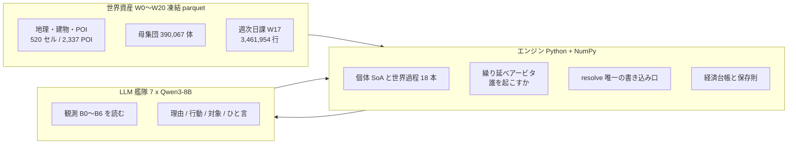
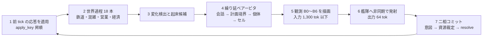
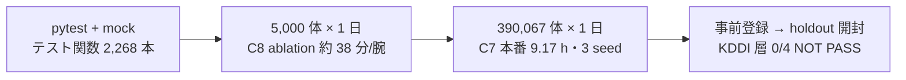

# v2 アーキテクチャ概要 — 簡略版(5 分で全体像)

> 初見の人向け。数値はすべてリポジトリ内のファイルから取り、出所を併記した(推測値は書かない)。
> 開発者向けの詳細は [v2-architecture-overview-detailed.md](v2-architecture-overview-detailed.md)。
> 正典は [v2-redesign.md](v2-redesign.md)(決定台帳)・[v2-methodology.md](v2-methodology.md)(開発方法論)。
> 最終更新 2026-09-19。

## 1. これは何か

現実の渋谷を仮想空間に再現する **LLM 社会シミュレーション第 2 世代**。
39 万体の人が、1 分刻み(1 tick)で 1 日 1,440 tick を過ごす。第一目標は「世界そのものがプロダクト」——
現実整合アンカー台帳を育て、**歪む場所を宣言する**こと(`CLAUDE.md` §1)。

設計の背骨は 1 行で言える:

> **状態と集約はエンジン、意思決定と発話だけ LLM**(`CLAUDE.md` §3)

エンジンが世界の法則(保存則・物理・台帳)を持ち、LLM は「観測を読んで次の一手を決める」だけをやる。
世界の変化はエージェントの行動の結果として起こす(棚が減るのは、店員が補充行動をしたから)。

## 2. 三層

- **世界資産**は 21 段階(W0〜W20)のビルドで一度だけ作り、ハッシュで凍結する。同じ入力から作り直すとバイト一致する(`src/shibuya/build/run.py`)。
- **エンジン**は破れない法則だけを持ち、世界状態への書き込み口は `engine/resolve.py` の 1 本に閉じている。世界過程も例外にしない。
- **LLM** は世界を書き換えられない。返すのは 2 行の文字列だけで、エンジンが前提条件を検査して受理/拒否する。

## 3. 1 tick で起きること

要点は 3 つ。

1. **全員は毎 tick 考えない。** 起床候補は 4 クラス固定優先で並び、その日の呼数予算に入った分だけが LLM に届く。あふれた分は捨てずに**繰り延べ**される(`src/shibuya/engine/arbiter.py`)。
2. **普段はエンジンが日課を進める。** 各体は W17 の予定表どおりに動き、LLM は「起床」したときだけ介入する。5,000 体の検証ランでは、世界で実行された行動 270,424 件のうち **87.6%(236,860 件)がエンジン継続**、LLM が決めたのは 12.4%(33,564 件)だった(`PENDING.md` D-98)。
3. **LLM の出力は 2 行に固定。** 1 行目「理由: 40 字以内」/ 2 行目「行動: 語彙 1 語 対象: … ひと言: 20 字以内」。行動語彙は 24 語で、語彙外の語は辞書で写すか未定義行動として台帳に残す(`docs/design/v2-action-contract.md` §1・§7)。

## 4. 規模と予算

| 項目 | 値 | 出所 |
|---|---|---|
| 舞台 | セル 520・歩行グラフ ノード 3,499 / 辺 4,944・建物 7,210・POI 2,337・組織 9,872・駅 12 / 出口 45 | `data/world/v2/W1,W2,W4,W6,W11.header.json` |
| 人 | **390,067 体** | `data/world/v2/W16.header.json` |
| 日課 | 3,461,954 行 = **8.88 ブロック/体/日** | `data/world/v2/W17.header.json`・`docs/research/v2-thought-frequency-anchors-note.md` §2 |
| 時間 | 1 tick = 1 分・1 シミュ日 = 1,440 tick | `src/shibuya/core/types.py` |
| LLM 呼の上限 **L4** | 400 万呼/シミュ日 = 40 万体基準で **10 呼/体/日** | `docs/design/v2-budget-declaration.md` L4・`src/shibuya/engine/arbiter.py` |
| 実測の呼 | 39 万体で **6.90 呼/体/日**(応答 2,691,795 呼)/ 5,000 体で 7.38〜7.44 | `docs/research/v2-thought-frequency-anchors-note.md` §2 |
| 壁時計 **W1** | 宣言 ≤24 h/シミュ日 → 実測 **9.167 h**(39 万体・1 日・実 LLM) | `docs/design/v2-budget-declaration.md` W1・`docs/ops/build-report-C7.md` |
| メモリ **M8** / 記録 **S1** | 宣言 ≤24 GB / ≤5 GB → 実測 1.530 GiB / 0.175 GiB | 同上 |
| 艦隊 | 7 × Qwen3-8B INT8・温度 0.7・出力上限 96 tok・生成 約 3,047 tok/s | `docs/bench/c8/ablation/ab7c_s1_parent_report.md`・`docs/design/v2-memory-agenda.md` §0 |

## 5. 検証の段

- 較正に使うデータと検証用 holdout は最初に分けてあり、較正は holdout に触れない(`CLAUDE.md` §4)。
- 封印は 3 層。`kddi_la`(2026-09-17 に 1 回だけ開封済み)・`shibuya_jinryu`・`boundary_counts`(未開封)= `data/world/v2/w19_freeze.json`。
- 開封前に腕・指標・合格線を文書で固定し、外れたら外れたと書く(`docs/bench/c7/prereg_arms_v1.md`)。

## 6. いま分かっている穴(数字つき)

| 何 | 現実 | いまのシミュレーション | 比 |
|---|---|---|---|
| 思考の回数 | 4,000〜6,240 回/日 | LLM 呼 6.90 回/日 | **1/580〜900** |
| 会話 | 覚醒時間の 27.9% | 0.0021 セッション/体/日 = 410 件/日 | 事実上ゼロ |
| 内省・心のさまよい | 覚醒の 46.9% | 日次内省 **0 回**(本番で発火していない) | ゼロ |
| 活動の切り替わり | 13.9 回/日 | 計画ブロック 8.88 本/日 | 0.64(桁は合う) |
| 在圏のピーク時刻 | KDDI 15〜18 時 | 10〜13 時(5 エリア全部) | **3〜8 時間早い** |
| 来街者比 | KDDI 0.40〜0.76 | 0.14〜0.39 | 半分以下 |

出所: 現実側 = `docs/research/v2-thought-frequency-anchors-note.md` §1(Tseng & Poppenk 2020 ほか)/
holdout 側 = `docs/bench/c7/prereg_arms_v1.md` §8(開封結果 0/4 NOT PASS)。

**この表がこのプロジェクトの正直な現在地**である。人間 1 人ぶんの思考量に LLM 呼で届かせるのは、
本番規模で L4 の 390 倍が要り、この艦隊でも 100 倍の艦隊でも不可能(同ノート §4)。

## 7. いま決めようとしていること

- **D-98 検証指標の組み直し** — 「販売数 ÷ 呼数」のような単一比を忠実度に使わない。実現量/体/日・実現/選択・呼あたり効率・費用・選択分布の差、の 5 本に分ける。
- **D-99 予算 L4 の感度腕 AB8** — 10 呼/体/日という上限が結果を形作っていたかを、0.5×/1×/2×/無制限の 4 腕で測る。
- **D-100 状況固定のオフライン評価** — テープの同じ観測に腕ごとの文面で答え直させ、世界を挟まずに選択分布だけ比べる。
- **D-101 思考の階層と目標頻度** — ① 活動の切り替わり ② 型付きの速い判断 ③ 言葉の熟考 ④ 会話、の 4 階層に分け、各階層の目標頻度を人の錨に結ぶ。

いずれも `PENDING.md` の D-98〜D-101。全決定は仮であり、何度でも変更できる(`CLAUDE.md` §2-1)。
