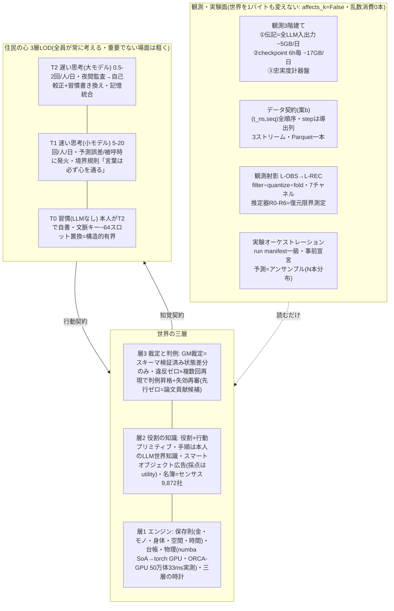
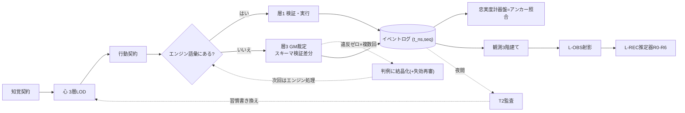

# v2統合設計図+ロードマップ(D16/U13草案・2026-09-02起草)

> **状態: レビュー待ち草案。台帳(v2-redesign.md)に転記されるまで設計を拘束しない。**
> 決定台帳の全決定(仮)+ディープリサーチ15ユニット35面の答申を一枚に統合したもの。
> 図解版(レビュー用アーティファクト)と同内容のリポジトリ正典。数値は各答申の[事実]検証済み値。

---

## 1. アーキテクチャ全景

- **背骨**: **状態と集約はエンジン、意思決定と発話だけLLM**(**4つの異なる先行群と両立=引用に重複なし**。**第210 訂正・出典 [v2-r23-primary-check-batch2.md](../research/v2-r23-primary-check-batch2.md) §3**: 分業は08-29の設計前提であり、経済・会話・人流・制度の4答申は同一の依頼文から相互参照つきで走った=**独立検定ではない**。「35面」も同一プログラム(v2-deep-research-program.md の15ユニット)の出力なので面数は独立性の証拠にならない)。
- **時間**: 物理=連続+密度LOD/認知=イベント駆動/制度=日次。思考はシミュ内時間を消費: δ = max(0.2s, α×出力token)(α較正済: T2熟考0.04・発話0.27・読解0.18秒/tok)。会話はターン逐次。
- **世界を閉じる基盤4モジュール**(いずれも答申済み):
  - **境界**: 確率的ゲートウェイ+低解像度外界・名簿≒100-150万で在場40万・流入5類型・修正absorbing。境界の歪みは集計でなく構造(k*)に出る→感度ゲートで無害化。
  - **経済SFC**: 5部門+RoW・保存則テスト5層・revenueを計算値にできない型設計=v1循環定義を構造的に不可能化。
  - **制度**: 5プリミティブ(台帳・時計・集約・資格判定・配信)のみ・足場なしablation A0-A4+制度出現の相図=新規性。
  - **適応3ループ**: 記憶:習慣:判例=時定数1:5:25・影響辺は書き込み時記録(判例最遅=扇出のため)。
- **憲法6原則**: ①LODで吸収 ②実フロー経済 ③心と世界の相互可視 ④解像度は較正とペア ⑤知覚されない細部は作らない ⑥粗くする場所は宣言。

## 2. データの一巡

## 3. 構築の梯子(Phase 0-5・日付でなくゲートが支配)

| Phase | 内容 | ゲート |
|---|---|---|
| **0 設計完了**(現在地) | 決定対話完走+パターン台帳+予算宣言(コードなし) | 台帳~30本+holdout・研究質問1文 |
| 1 紙上検証 | ODD+経済SFCを紙上で閉じる(数日) | 紙上で保存則が閉じる |
| 2 最小骨格 | 数千体CPU・保存則+SoA+忠実度計器盤+mock LLM+細い縦切り(数百体+実LLM1本)(1-2週) | 全テスト緑+性能/バイト予算内 |
| 3 GPU化+較正 | torch移植・人流アンカー較正(1-2週) | 較正合格+holdout非接触 |
| 4 認知+三層世界 | T0/T1/T2・ターン逐次会話・裁定層+validation/ablation(2-3週) | 照合レポート+artefact試験 |
| 5 スケール | 10万→40万・オーケストレーション・多ラン(継続) | 初のフルスケール・アンサンブル |

契約ファースト: 知覚契約・行動契約・LLM挿入点IFを先に固定→Phase 2で縦切り貫通でIF誤りを早期検出。

## 4. ロードマップ(短期・中期・長期)

### 短期 2026-08-31→09-24 「本選資産の確保と二つの応募」
完了判定=未踏エントリー提出+ベンチ実測値+Phase 0の2ゲート通過。
- [済] 本選データ退避(Run A/B・件数照合済)・ディープリサーチ35面完走
- 今週: レビュー決着(U1-U16・線引き16行表・ベンチ台帳)→D15パターン台帳選定(44本→~30本+holdout)→新リポ作成(U16)
- **★〜09/10 サーバー返却前**: vLLM艦隊ベンチ実走(U-H設計済)+未踏応募用実測データ確保=**短期で唯一の不可逆項目**
- 9月中: さくらDOK個人契約・AWS Activate申請・arXivエンドースメント・ESSA加入(€50)
- **★09/24 13:00 未踏アドバンスト下期エントリー**(書類09/25 13:00・個人可・1名上限800万円・委託費=開発工数として設計)

### 中期 2026-10→12 「v2骨格を立て、年内に最初のフルスケール・アンサンブル」
完了判定=Phase 4ゲート通過+忠実度計器盤が毎ランでアンカー照合。
- 10月: Phase 1紙上SFC→Phase 2最小骨格/10-11月: Phase 3 GPU化+較正/11-12月: Phase 4認知+三層世界=判例結晶化ループの初実測(論文貢献の初データ)
- 12月: Phase 5入り・10万→40万・初アンサンブル(目安: フルスケールまで~2ヶ月)
- 並行: LLM供給分岐(従量APIで実測→GPU稼働率で自前vLLM移行判断)・ABCI開発加速購入判断・未踏結果対応

### 長期 2027→ 「世界がプロダクトになる」
完了判定=査読付き初出版+外部資金1本+100万体級実行実績。
- アンサンブル予報の常時運用・アンカー台帳の成長=北極星KPI・歪む場所の宣言
- 論文4方向: EPJ DS(純holdout)/JASSS(判例結晶化)/ICWSM(A/B対照)/NeurIPS E&D 2027(観測射影・締切5月上旬・コード実行可能性が投稿条件)
- 制度アクセス根本解: 法人化or客員研究員(ABCI・科研費・Inception・IRBを一挙解錠)・アドバイザー3レーン
- 規模次段階: 100万体+(FLAME GPU 2 or torch多GPU=Phase 5実測後判断)・任意タイル拡張・L-OBS/L-REC観測アプリ
- 常設レーン: 三層方式の代替案リサーチ・ゲーム/VR技術輸入

## 5. 決定ボード

- **決定済み(仮・台帳転記済16件)**: 第一目標=世界がプロダクト/優先=多ラン>高速化>規模/可搬性最優先/ゼロベース+シンプル/憲法6原則/三層世界+修正3点/認知3層案B′/三層の時計+δ式/データ契約案b/観測3階建て/忠実度回帰検収/新規リポ/移行=門前条件制/ゲーム技術輸入/物理=numba→torch/Phase 0-5ゲート制
- **判断待ち(U1-U16)**: 解錠キー=U13(本図)→U12(パターン台帳)→U16(新リポ)。他: U1記憶(c)推奨・U2習慣seed・U3 D6追記2点・U4 L-OBS時期(a)・U5スマートオブジェクト・U6 LOD昇格・U7チャンクSoA・U8-11(起草→レビュー)・U14-15(実測後)
